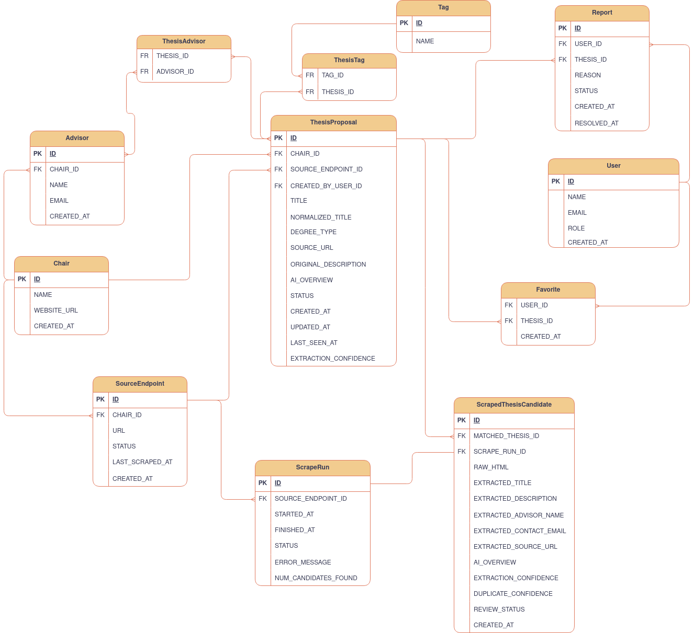

# Product Requirements Document - Project 95

#### 0. Product Overview

This project aims to build a centralized web platform for discovering open Bachelor’s and Master’s thesis topics at TUM. The platform aggregates thesis proposals from different chair websites, stores them in a structured database, and provides students with search, filtering, favorites, and links to the original postings. 

The system combines periodic web scraping with AI-based information extraction to transform heterogeneous chair website content into standardized thesis entries.
#### 1. Problem Statement
At the Technical University of Munich (TUM), Bachelor's and Master's students must write a final thesis at the end of the course in order to graduate. A thesis topic can be realized in three ways:

- Students get accepted to take on an open thesis;
- Students come up with their own idea for a thesis;
- Students partner up with industry for a thesis;

The common denominator for all these options is that a TUM chair must supervise the thesis, which implies that the specific thesis **must** be aligned with the interest of the specific chair, as the chair not only grades the work, but also provides an advisor (usually PhD candidate at the chair) to assist the student. 

Coming up with an idea for a thesis or partnering up with industry are by far the most unlikely scenarios, especially when it comes to a chair agreeing to supervise it. Therefore, applying for an open thesis is the path the majority of the students follow.

Essentially, PhD candidates at TUM's chairs are naturally taking on a very complex and/or vast research topic. For this reason, many thesis proposals are connected to ongoing research projects at TUM chairs. Researchers often publish thesis topics to **involve students** in specific subproblems, implementations, experiments, or literature studies related to their research area.

In order to find helpers, PhD candidates post about  "open thesis" topics on their chair's websites.  This creates an **information gap** that the proposed platform aims to address:
- Chair's websites do not have to follow a specific structure $\rightarrow$ harder to find where to look;
- Varying levels of description about the open theses' topic;
- Chair's websites are not in evidence $\rightarrow$ interesting topics can be missed/overlooked;
- Even with dedication, navigating through all possible chair's websites and finding where open theses are listed is massively time consuming and frustrating;


#### 2. Solution Proposal

In order to **centralize** and **organize** information, an online platform can be created that encapsulates information about open theses in multiple chairs within one database.

There have been other attempts of creating such platforms, the problem is that they didn't generate the necessary traction for researchers to post on these platforms. Letting chair researchers post on the centralized platform is an obvious feature, however generative AI can be leveraged to fill the database even when researchers don't bother to also post in the platform.
- Backend possess and pre-defined, yet updatable, list of chairs' endpoints where the open theses are supposed to be found and displayed;
- Backend tool performs a web-scrape of these pages and extracts raw HTML information;
- Backend calls AI-agent to process raw data;
- Agent receives raw data as input $\rightarrow$ structured output includes :
	-  Chair name
	- Advisor information (name, email);
	- Original thesis description;
	- **AI overview of thesis topic**;
- Frontend allows user to perform queries to the database (Chair name, keywords...).

Generative AI allows the platform to process unstructured data scraped from websites produce structured *json* output that is used by the backend to add new entries to the database. 

Not only that, the AI overview on top of the original description is another major advantage. Firstly, open theses with poor description create little interest from students, the AI overview can add additional context and expand from the little information originally given. Secondly, for theses with dense descriptions, the AI overview can act as a more digestible summary, which prepares the student for the more dense, original thesis description, if the summary calls their attention.

#### 3. Goals

- Centralize open thesis proposals from multiple TUM chair websites.
- Reduce the time students need to find relevant thesis topics.
- Provide structured search and filtering across thesis proposals.
- Increase visibility of open thesis topics from different chairs.
- Use AI to extract structured thesis information from heterogeneous webpages.

#### Success Metrics

- Number of indexed thesis proposals.
- Number of supported chair websites.
- Percentage of thesis entries with complete metadata.
- Average search response time.
- Number of student favorites / saved theses.
- Number of outdated or invalid thesis entries reported by users.
#### Non-Goals

It is not part of the core goal to create a platform where students can directly apply to the open theses, and/or interact with the thesis advisor.  

#### 4. Target Users

The target users are TUM bachelor and masters students trying to find a fitting thesis topic. Nevertheless, TUM researchers might enjoy the benefit of their open thesis proposals getting extra visibility. 
#### User Stories

- As a student, I want to search for thesis topics by keyword so that I can quickly find topics related to my interests.
- As a **student**, I want to filter thesis proposals by chair, degree type, and research area so that I can narrow down the results.
- As a **student**, I want to save interesting thesis proposals so that I can compare them later.
- As a **student**, I want to open the original thesis posting so that I can verify the details and contact the advisor.
- As a **researcher**, I want to manually add a thesis proposal so that it appears in the centralized platform.
- As an **admin**, I want to review AI-extracted thesis entries so that incorrect or duplicated entries can be corrected.
#### 5. Functional Requirements
##### 5.1. Platform Website (Frontend)
- Student should be able to filter the search query;
	- Chair Name
	- Thesis Title (keywords)
	- Thesis broad research area (Math, Physics, Mechanical Eng., Electrical Eng., Software Eng., Cryptography, Bioinformatics....)
	- Starting time frame (if applicable)
	- Extra keywords/tags that relate to theses descriptions
- Student should be able to mark theses that interest them (add to favorites);
- Student should be able to click on the link of the original thesis post;
- Student should be able to report if thesis listed on the platform is not available on the original website, reports should trigger re-scrape and potentially trigger the deletion of the entry;
- TUM researchers should be able to manually add/remove their open thesis proposals
- Admins should be able to add, edit, and remove chair website endpoints.
- Admins should be able to inspect scraper runs and failed extraction attempts.
- Admins should be able to manually edit AI-generated thesis entries.
- Admins should be able to approve, reject, or merge suspected duplicate thesis entries.
- Admins should be able to review user reports about unavailable thesis postings.

##### 5.2. Scraping and Data Ingestion

- Periodically scrape predefined chair website endpoints.
- Extract candidate thesis postings from raw HTML.
- Store scraper run metadata, including timestamp, source URL, status, and errors.
- Mark thesis entries as potentially unavailable if they are not found in multiple consecutive scrape runs.
- Discern if scraped open thesis is already in the database, matching by chair, title and advisor. There is a small chance that the title is altered $\rightarrow$ Detect duplicate using a combination of:
	- normalized title similarity;
	- chair name;
	- advisor name or contact email, if available;
	- source URL;
	- extracted description similarity;
	- previous scrape history.

##### 5.3. Backend API

- Provide search endpoints for querying thesis proposals.
- Provide endpoints for retrieving thesis details.
- Provide endpoints for saving theses as favorites.
- Provide endpoints for reporting unavailable thesis entries.
- Provide authenticated endpoints for researchers to create, update, or delete manual thesis proposals.
- Provide authenticated admin endpoints for managing chair sources and reviewing reports.
##### 5.3. Platform GenAI
The backend calls the AI Agent for multiple functions:
- Raw HTML data extraction $\rightarrow$ structured output:
```
[
  {
    "title": "string",
    "title_keywords": ["string"],
    "degree_type": "Bachelor | Master | Bachelor/Master | Unknown",
    "chair_name": "string",
    "advisor_name": "string",
    "contact_email": "string",
    "source_page_url": "string",
    "original_description": "string",
    "ai_overview": "string",
    "research_area": "string",
    "tags": ["string"],
    "starting_timeframe": "string",
    "last_seen_at": "datetime",
    "extraction_confidence": "number"
  }
]
```

#### 6. Non-Functional Requirements

- Performance: Search results should be returned within an acceptable response time, e.g. under 2 seconds for normal queries.
- Reliability: Scraping failures should be logged and should not break the platform.
- Data Quality: AI-extracted fields should include confidence scores or be reviewable by admins.
- Security: Researcher and admin actions must require authentication.
- Privacy: Student favorites should only be visible to the respective student.
- Maintainability: New chair endpoints should be addable without changing core application logic.

#### 8. System Architecture

The system consists of:
- a frontend web application;
- a backend API;
- a relational database;
- a scraping service;
- an AI extraction service;
- an admin interface;
- external chair websites as data sources.

#### 9. Risks and Open Questions

- Chair websites have different structures and may change over time.
- Some thesis postings may be embedded in PDFs or dynamic pages.
- AI extraction may produce incorrect or incomplete fields.
- Duplicate detection may be difficult when titles or descriptions change.
- Automatically removing theses may delete still-valid entries.
- Researchers may not adopt the manual posting feature.

#### 10. Acceptance Criteria

- Students can search and filter thesis proposals.
- Each thesis entry links to the original source page.
- The backend can scrape at least a predefined set of chair websites.
- The AI extraction pipeline produces structured thesis entries.
- Duplicate thesis entries are either merged or marked for review.
- Admins can manage chair endpoints and correct extracted data.

**MVP Features:**

- Search and filter thesis proposals.
- Display thesis details and original source link.
- Periodic scraping of a small predefined set of chair websites.
- AI extraction into structured database entries.
- Basic duplicate detection.
- Admin review/edit interface.


