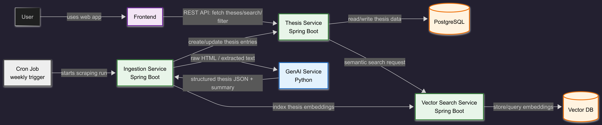

# System Architecture Overview

The system is divided into a frontend client, three Spring Boot backend microservices, a separate Python GenAI service, and persistent storage. The goal is to keep the system modular while still keeping the implementation manageable for the project.

### Client

The client is implemented as a web frontend using React. It provides the user interface for browsing thesis proposals, searching thesis topics, applying filters, viewing thesis details, and opening the original thesis source page.

The frontend communicates with the backend through REST APIs.

### Server

The server side is implemented using Spring Boot REST APIs and split into three microservices:

| Service | Technology | Responsibility |
|---|---|---|
| Thesis Service | Spring Boot | Provides the main thesis API, stores and retrieves thesis proposals, handles filtering and thesis details |
| Scraping Service | Spring Boot | Runs the scraping workflow, fetches thesis pages from chair websites, calls the GenAI service, and imports extracted thesis data |
| Vector Search Service | Spring Boot | Provides semantic search functionality and manages communication with the vector database |

The services communicate over REST. The Thesis Service is the main user-facing backend service. The Scraping Service runs mostly in the background and is triggered periodically. The Vector Search Service is responsible for semantic retrieval.

### GenAI Service

The GenAI component is implemented as a separate Python microservice using LangChain. It receives raw HTML or extracted page text from the Scraping Service and returns structured thesis information.

Example output fields include:

- thesis title
- degree type
- original description
- AI-generated overview
- research area
- advisor/contact information
- source URL
- extraction confidence

The GenAI service does not directly write to the database. It only returns structured data to the Scraping Service.

### Database

The system uses PostgreSQL as the relational database. It stores structured thesis proposals, chairs, source endpoints, scrape runs, advisors, and tags.

A vector database is used separately for semantic search. It stores embeddings and allows similarity-based retrieval of thesis proposals.
